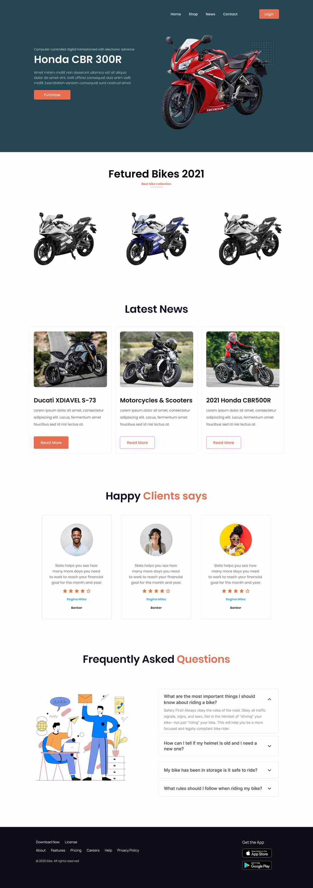

# Honda CBR 300R 🏍🏍

A responsive landing page build using Bootstrap.

## Description

This project is built as an assignment project for Programming Hero Course.

### To See the deployment: [Netlify Deployment](link) 🌐

## The Design

To See the design file in Figma follow this link:
[HondaCBR.fig](https://www.figma.com/file/b7HozlHUkngppAXom0eO4e/honda-cbr?node-id=1%3A102)

## Requirements

- The site has to Responsive to mobile Devices and PCs.

- Use Bootstrap CSS.

- Colors Should be adequate to eye.

## Sections wise requirements are listed below

### 👉 Header

- The primary navigation bar is optional
- The Banner must take 100% width of the viewport space.
- The Header Bike Image is compulsory But it's background detail is optional.
- The background color of the header should match the design.
- The purchase button should prompt a modal with relevant element.

### 👉 Featured

- The Details lines are optional.

### 👉 Testimonial

- An Image filter should be applied to them images. I.E filter: Hue Rotation
- The Header Bike Image is compulsory But it's background detail is optional.

### 👉 Latest News

- This part is optional
- The Heading of this section should have a isolated design using span tag or
  something.
- Icons should be sourced from suitable platform.

### 👉 FAQ

- All the FAQs should be presented in an Accordion formation.

### 👉 Footer

- Footer Is optional.

### 👉 Bonus

- Two additional section
- Contact US, Gallery.

## Thank you for visiting my project
